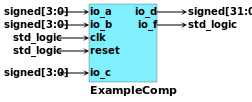
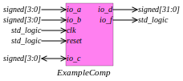

# HDL to IMG
Produces graphical representation of HDL component.
At the moment it is possible to generate SVGs out of VHDL components. 
A JSON configuration file represents how the output image is produced

## Examples

Let's say we have the following component declaration in VHDL:    

```vhdl
entity ExampleComp is
  port(
    io_a : in signed(3 downto 0);
    io_b : in signed(3 downto 0);
    io_c : inout signed(3 downto 0);
    io_d : out signed(31 downto 0);
    io_f : out std_logic;
    clk : in std_logic;
    reset : in std_logic
  );
end ExampleComp;

```

Here there are some examples of the produced images using hdltoimg: <br /> 

Serif Bold font, Top Left component name, arrow style None: <br/>


Arial Bold font, Top Center component name, arrow style Full: <br/>


FreeMono Bold font, Top Right component name, arrow style Empty: <br/>


FreeSans Bold font, Bottom Left component name, arrow style Reentrant: <br/>


Serif Italic font, Bottom Right component name, arrow style Minimal: <br/>

<br/>
Here it is the JSON configuration file for the last example

```json
{
"figPadX": 4.0,
"figPadY": 4.0,
"compPadX": 1.0,
"compPadY": 2.0,
"compFont": {"font": "Times New Roman", "weight": "ITALIC", "size":11},
"compAlignment": ["Bottom", "Right"],
"boxTickness": 0.25,
"boxFillColor": [1.0, 0.5, 0.94],
"boxWidthPolicy": {"type": "BoxSigNamePad", "pad": 20.0},
"boxBorderPad": 2.0,
"sigPadX": 1.0,
"sigPadY": 1.0,
"sigFont": {"font": "Times New Roman", "weight": "ITALIC", "size":10},
"descPadX": 1.0,
"groupPadY": 10.0,
"groupPolicy": {"type": "SimplePolicy"},
"arrowLength": 30.0,
"arrowPadX": 0.0,
"arrowThickness": 1.0,
"arrowTipSize": 3.0,
"arrowStyle": "StyleMinimal",
"outputType": "SVGTypeOutput",
"removeDefaultInputArg": true
}
```

## Usage

If HDLtoIMG is not installed system wide you can use it through **sbt**:
```bash
    sbt "runMain com.github.hdltoimg.vhdl.VhdlToImg -i source.vhd -c conf.json"
```

otherwise you can simply type

```bash
    vhdl-to-img -i source.vhd -c conf.json
```

Note that the the -c switch is optional. In this case a default configuration will
be applied.

### Size mappings
<br/>


maps to the following JSON properties: <br/>


### Box width

The resulting component box size is determined by the **boxWidthPolicy** field

#### Constant width mode

The width of the box is constant

```json
    "boxWidthPolicy": {"type": "BoxConstantWidth", "width": 20.0}
```

#### Pad mode

The width of the box is the sum of a pad value plus the size of the signal names

```json
    "boxWidthPolicy": {"type": "BoxSigNamePad", "pad": 20.0}
```

#### Ratio mode

The width of the box is equal to the height multiplied by a ratio

```json
    "boxWidthPolicy": {"type": "BoxConstantRatio", "pad": 1.0}
```
.. for a square box


### Grouping

For components with a lot of ports sometimes the resulting image looks a bit difficult to read:


The above example shows the interface of a CPU. It would be better to group together the 
signals that belong to the same bus. This is possible using the 
**RegexGroupsPolicy**. With this policy the signals are grouped using a regex
(**groupRegex**) that matches the group name. For example:  

```json
    "groupPolicy": {"type": "RegexGroupsPolicy", "groupRegex": "^([^_]*).*"}
```

Produces:


### Font weight

There are four options:

- PLAIN
- BOLD
- ITALIC
- BOLDITALIC


## Installation Requirements

- SBT
- Java JRE
- Java JDK
- zip

### Debian

- dpkg-deb
- dpkg-sig
- dpkg-genchanges
- lintian
- fakeroot

### RedHat

- rpm
- rpm-build

### Windows

- [WIX Toolset](https://wixtoolset.org/)

## Installation

The packaging process is based on [sbt-native-packager](https://www.scala-sbt.org/sbt-native-packager/introduction.html). More options for package generation are available at that site.

### General

```bash
    sbt universal:packageBin
```

Generates a .zip in target/

### Debian
```bash
    sbt debian:packageBin
```

Generates a .deb in target/

### RedHat
```bash
    sbt rpm:packageBin
```

Generates a .rpm in target/

### Windows

Before launching the compilation command two values have to be adjusted in
build.sbt to your Wix Toolset installation: **wixProductId**, **wixProductUpgradeId**

```bash
    sbt windows:packageBin
```

Generates a .msi in target/

## Todo

- Cross arrows when the signal is ranged
- SpinalHDL support
- Other languages support (Verilog/Chisel)
- Test the package build process on other platforms other than Linux

## Notes

All the HDL examples were produced using [SpinalHDL](https://github.com/SpinalHDL/SpinalHDL) and
[VexRiscv](https://github.com/SpinalHDL/VexRiscv)
